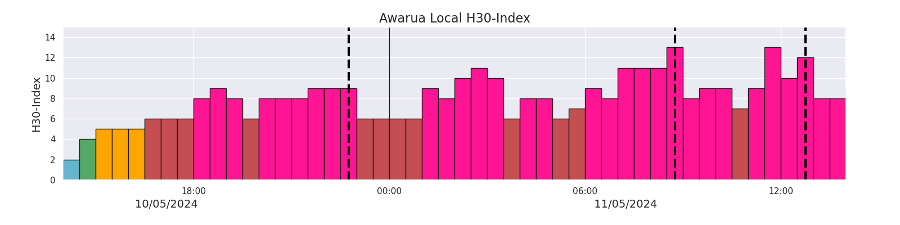

# H30-Indices

H30-Indices, an adapted form of K-indices developed by Yamazaki et al., 2022. Here, an adapted set of python scripts used to derive K-index can also derive H30 and H60-Indices. The original K-indices script was developed by the TCD Solar Physics Group, https://github.com/TCDSolar/K-IndexCalculator (Blake, 2017). These scripts were updated to operation capacity to derive K-Indices for the MagIE website by the DIAS/TCD Solar Physics group (Malone-Leigh, 2025). Here, slight tweeks were made to allow the scripts to generate H30-Indices.

Two inputs can be natively be used for this model:

o Intermagnet data formatted in IAGA-2002 format
o The Magnetometer Array of Aotearoa New Zealand (MANA) style txt files

In essence, the adaptation is simple. The original function to calculate K-indices was adapted by:
  a) removing the K = 9 limit for H60 and H30 and replacing it with an unbounded limit following Yamazaki et al. 2022. 
  b) Allowing the K-index module to run at a shorter 60-minute and 30-minute cadence compared to the normal 3-hour.
  c) A new plotting function was created to allow for these shorter windows.

An adaptation Finnish Meteorological Computing method is used to subtract the solar regular curve(Menvielle et al., 1995). 

Different modes can be selected dependent based on the needs. The main two modes are H30 and Hpo30. H30 generates the local H30 indices, Hpo30 generates planetary Hpo indices using data downloaded from GFS science. The H60 and Hpo60 version of these can also be used 

# Example Output

An example output from Awarua for the May 2024 "Gannon" storm is shown below:

# Packages Required

Most versions of these packages should work. The specific packages I used were 

o Python 3.8.3
o Numpy 1.23.1
o Scipy 1.9.3
o Matplotlib 3.6.2
o Seaborn 0.12.2 (optional for plotting)
